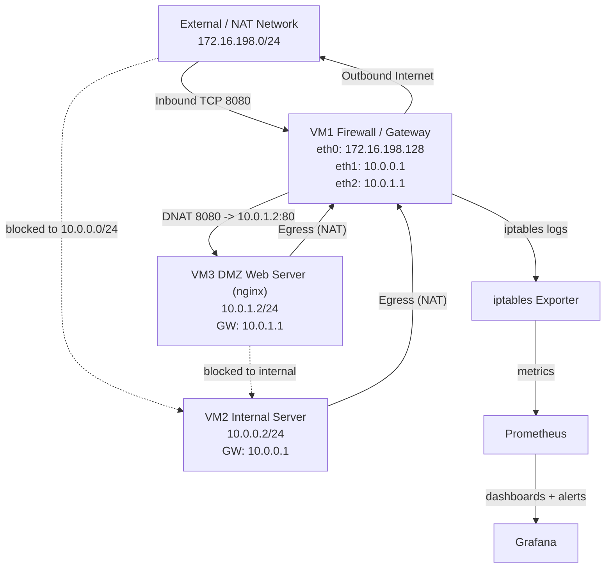

# Firewall Monitoring Lab Topology

## Mermaid Diagram



## ASCII Topology

```text
                External / NAT Network
                    172.16.198.0/24
                           |
                           | VM1 eth0: 172.16.198.128
                  +--------+--------+
                  | VM1 Firewall/GW |
                  |  iptables + NAT |
                  +----+--------+---+
                       |        |
       VM1 eth1: 10.0.0.1   VM1 eth2: 10.0.1.1
                       |        |
                   10.0.0.0/24  10.0.1.0/24
                       |        |
                 +-----+--+   +--+----------------+
                 | VM2    |   | VM3               |
                 |Internal|   |DMZ Web (nginx)    |
                 |10.0.0.2|   |10.0.1.2           |
                 +--------+   +--------------------+

Telemetry path:
iptables logs -> exporter -> Prometheus -> Grafana
```

## Policy Notes

- Allowed: `Internal -> Internet` and `DMZ -> Internet` through NAT on VM1.
- Allowed: `External -> DMZ` only on TCP `8080` via DNAT to `10.0.1.2:80`.
- Blocked: `External -> Internal` and `DMZ -> Internal`.
